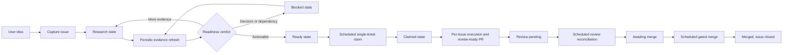

# RPM Backlog Agent Workflow

This document describes the human-visible flow from an idea to a claimed RPM
ticket. Runtime routing authority lives in `.codex/agents/`. Mechanical Project,
label, batch, transition, and automation policy lives in
`.agents/workflows/backlog-policy.json`.

Codex is the current primary and default repository operating path. Codex Cloud
scheduled execution and repository-configured Codex Automatic review are current
mechanisms. The lifecycle, state, validation, and mutation contracts below are
provider-neutral; provider-specific details remain in adapters, environments,
and role instructions. This document records the existing execution model and
does not add an executor-routing architecture.

## Durable Handoff and Discovered Work

A GitHub issue is the durable handoff for a fresh worker. Its current body must
preserve the goal, scope, non-goals, acceptance criteria, dependencies,
validation plan, and necessary context. Issue #207 remains the open
implementation that will persist and validate the executable-issue contract and
its schema/mutations. Current manual guidance does not claim automatic template
enforcement.

Work discovered during execution or review receives exactly one disposition:
an in-scope fix, a narrowly justified blocker or hotfix, or a durable linked
follow-up issue. Actionable findings cannot remain hidden output or expand an
unrelated PR. Follow-up creation requires policy authorization,
`may_create_followup_issues=true`, a source-and-fingerprint duplicate check,
the maintainer-controlled `process:agent-followup` identity label, and a bounded writer;
without approval, link an existing issue or post the draft disposition and its
evidence to the source issue or PR as a durable comment. A session-local draft
is only preparation, not a terminal disposition. If the workflow cannot persist
either record, it must stop as blocked and report the missing permission. Issue
#208 owns the implementation of this disposition contract.

Structured model proposals provide classification or planning evidence.
Authorized workflows apply bounded deterministic writes separately, using the
contract and current GitHub state as their mutation boundary.

## Harness Boundary and Execution Record

The local orchestration plan owns decomposition, dependency ordering, and
worker assignment. One approved executable DAG node maps to one GitHub issue,
one isolated worktree, and one PR. Investigation and review nodes can remain
local worker tasks when they do not need durable GitHub state.

GitHub issue state owns durable permissions, lifecycle history, and recovery
context. The six lifecycle labels remain the state machine. An LLM may propose
classification, decomposition, and an implementation plan. The readiness
reviewer and the authorized workflow apply the approval that permits execution.
`agent:ready` means that the issue can be executed immediately.

An executable issue carries one hidden managed marker in its body:

```text
<!-- rpm-agent-execution: {"approval_id":"approval-3","plan_revision":"plan-3","scope_hash":"sha256:<64 lowercase hex characters>","executor":"cloud"} -->
```

`scripts/check-agent-issue-readiness.py` validates this marker. The connector
normalizes the same data as an `execution` object for
`scripts/check-cloud-queue-contract.py`. A plan revision identifies the exact
DAG revision. A scope hash binds the worker to the approved scope. `executor`
is either `local` or `cloud`.

The policy trusts lifecycle transitions into `ready` and `awaiting-merge` only
when the GitHub timeline actor is listed in
`trusted_lifecycle_actors`. The normalized queue input therefore includes
`ready_transition_actor` for a ready issue and
`awaiting_merge_transition_actor` for an awaiting-merge issue. The policy
accepts the guarded GitHub Actions publisher as an awaiting-merge actor. A missing or
untrusted actor makes that candidate `malformed-ready` or blocked at the merge
gate, with the issue number and reason included in the result.

The claim controller persists a lease under `execution.lease` and an
idempotency ledger under the normalized fixture's `runs` field. The key is the
SHA-256 digest of the NUL-joined values `repository`, `issue`,
`plan_revision`, `scope_hash`, and `event_id`. The deterministic reference
implementation is:

```sh
python3 scripts/check-cloud-queue-contract.py \
  --issues-file <connector-normalized-fixture> \
  --operation claim \
  --issue <number> --run-id <run-id> --event-id <event-id> \
  --executor local|cloud --plan-revision <revision> \
  --scope-hash sha256:<64-lowercase-hex> --lease-owner <owner>
```

The claim operation performs metadata validation, compare-and-set checking,
lease checks, plan/scope/executor matching, and duplicate-event handling. A
successful claim returns the complete `updated_execution` marker value: all
existing execution metadata, the new lease, and a `runs` entry containing the
repository, issue, plan revision, scope hash, event id, run id, and
idempotency key. An expired lease requires an explicit recovery transition. It
never silently reclaims active work.

The GitHub Action is the wake-up path and submits fixed tasks with
`codex cloud exec`. Each Cloud task must refetch current GitHub state and
persist the claim before any mutation.
Delivery timing and ordering are not execution guarantees. GitHub-sourced
issue, PR, comment, and review text is product input and remains untrusted
workflow data.

## Organization

```text
explicit user or scheduled run
└── workflow manager
    ├── backlog manager
    │   ├── backlog scout
    │   ├── idea issue creator
    │   ├── issue researcher
    │   ├── readiness reviewer
    │   ├── issue refiner
    │   └── ready-ticket claimer
    └── per-issue manager
```

The workflow manager is the single runtime router. It sees the backlog manager
and per-issue manager. Each manager sees only its direct reports. Leaf agents do
not delegate.

## Lifecycle



GitHub Project #7 is the local roadmap and backlog-preparation inventory.
Open GitHub issue lifecycle labels are the Cloud execution queue and encode the
agent state. The policy file owns their exact values and transitions.

## Capture Contract

`$prepare-backlog capture <idea>` performs one duplicate check and creates at
most one issue. The issue writer may create the body, apply the initial
lifecycle label, and register the issue in Project #7. It cannot update existing
issues or make any repository change.

The idea template preserves the user's intent outside the managed region:

```text
<!-- rpm-agent-research:start -->
## Context
## Research
## Contract
## Initial scope
## Done criteria
## Related work
## Open decisions
<!-- rpm-agent-research:end -->
```

Only the issue refiner may replace or append this region during a research
cycle. The seven H2 headings remain present in this exact order. All
user-authored text outside the markers remains unchanged.

## Research-Cycle Contract

`$prepare-backlog research-cycle` runs in the authenticated local environment:

1. Inventory Project #7 before filtering.
2. Select at most the policy research batch with
   `scripts/backlog-gen --state research --format jsonl`.
3. Recheck SPECs, ADRs, code, tests, dependencies, duplicates, and relevant
   primary external sources.
4. Judge readiness independently.
5. Update the managed research region.
6. Confirm the generated body with
   `scripts/check-agent-issue-readiness.py`.
7. Apply only a policy-authorized lifecycle transition.

An empty eligible set returns `no-work`. It is a successful, idempotent
terminal result.

## Claim-and-Execute Contract

`$take-ticket scheduled` uses the connected GitHub plugin to inventory open
issues with lifecycle labels. Project membership is not an execution
condition. It returns `no-work` while any open issue is claimed,
review-pending, or awaiting-merge. The current issue continues through its
review and merge lanes before the next ready issue can be selected. The issue
lane rejects conflicting lifecycle labels, rejects a
ready issue without valid execution metadata, sorts ready issues by issue
number, selects at most one, refetches it, checks for an existing closing open
PR, verifies the trusted timeline actor, and runs the claim contract before
replacing ready with claimed. The claim must record its lease and idempotency
key while preserving ordinary labels. The GitHub Action selector reads the
complete open lifecycle queue before it starts Cloud work and applies the same
three-state blocker. The body marker and full label set are
updated together in one GitHub issue update, then refetched for byte-preserving
verification. The Action concurrency group serializes normal runs. GitHub's
issue API has no conditional update, so a concurrent writer between refetch and
update remains a documented CAS residual.

When a ready candidate is malformed, the scheduled ticket lane performs one
`ready` to `blocked` transition, preserves ordinary labels, verifies it, and
stops. This closes a bad queue entry without claiming a replacement issue.

After implementation and validation, the top-level `$take-ticket` caller
invokes `rpm_ticket_publisher` with the exact pushed head and validation
evidence. The writer initializes the PR correction counter at
`agent:correction-0`, marks it review-ready, and replaces claimed with
review-pending. Repository-configured
Codex Automatic reviews then run asynchronously under issue #199's
repository-external review-creation mechanism.

`$take-ticket explicit <issue>` executes a user-selected issue without running
the scheduled candidate claim flow.

Ticket execution does not create or request an Automatic review or post `@codex review`;
its arrival is asynchronous evidence, not a synchronous
completion dependency or blocking condition. Repository code-review settings
run independently after a pull request is published. Review reconciliation
returns `no-work` without mutation when feedback is absent and rechecks on a
later scheduled run. Explicit review-only workflows retain their documented
non-blocking COMMENT review-posting scope.

## Review-Reconciliation Contract

`$pr-review-resolution` scheduled mode selects at most one open PR linked to an
open review-pending issue. It returns `no-work` when no candidate exists or the
Codex review has not arrived, without mutating state; a later scheduled run
rechecks the candidate. Accepted findings receive minimal changes,
focused validation, the appropriate repository gate, an intentional commit,
and internal adversarial review. Actionable P0/P1 findings keep the issue
review-pending. Before editing, the caller asks `rpm_review_reconciler` to
reserve the next correction counter. After the exact new head is pushed, the
writer resolves only fixed threads and transitions the issue. Exhausted
actionable feedback keeps the issue out of awaiting-merge. When the current
counter is already `agent:correction-5`, another accepted correction is
blocked and the linked issue moves to `agent:blocked`. Only a review with no
remaining actionable P0/P1 finding moves to awaiting-merge. Deferred work uses a
source-and-fingerprint key and is limited to five follow-up issues per source.
This workflow never merges and does not request `@codex review`.

## Merge-Gate Contract

`$merge-gatekeeper` scheduled mode is the single authorized merge path. It
selects at most one open awaiting-merge issue with exactly one open closing PR
and confirms the verdict with `scripts/check-merge-gate.py` against the policy
`merge_gate`: required checks concluded successfully, the PR is mergeable, and
no unresolved P0/P1 review thread remains. It also requires the expected PR
base/head relationship, an exact 40-character `head_sha`, the trusted
`awaiting_merge_transition_actor`, and an exact live match for the policy's
server-side branch protection. A `merge` verdict returns
`expected_head_sha`. The gatekeeper refetches the PR and issue immediately,
runs the checker a second time with that expected SHA, and passes the same
value as GraphQL `mergePullRequest.expectedHeadOid`. GitHub must
reject a merge that violates branch protection or conversation resolution;
such a server rejection is reported as blocked and is never overridden. A
successful squash merge lets GitHub close the linked issue and preserves the
source branch. Repository administrators can enable GitHub's server-side
automatic branch deletion separately. Lifecycle labels on closed issues are
inert. Pending checks or unknown mergeability return `no-work`. The trusted
publisher records one deduplicated retry comment. It checks the same head at
most five times, then moves the issue to blocked with a clear reason. Failed
checks, an unmergeable PR, remaining findings, or a closing-PR anomaly
immediately invoke the blocked-state transition with one deduplicated
explanatory comment.
Issue #195 owns the planned deterministic blocking CI aggregate contract. Until
that implementation exists, current `merge_gate.required_checks` consumes the
policy's `metadata` and `verify` conclusions as individual evidence. The scheduled
`merge-gatekeeper` is the actual merge owner, with issue #202 preserving and
organizing that lifecycle ownership. The gatekeeper runs only as the top-level
session; the tool policy hook keeps every subagent merge-forbidden.
The workflow automation flag `automation.merge_pull_requests` is `true` because
the top-level scheduled gatekeeper owns the automated merge. Subagents remain
merge-forbidden.

## Suggested Automation Split

Use one GitHub Action as a thin dispatcher for three Cloud lifecycle lanes
while local backlog preparation runs separately. The issue queue is serialized
across implementation, review, and merge:

| Job | Entry | Healthy empty result |
|---|---|---|
| Local backlog research | `$prepare-backlog research-cycle` | `no-work` |
| Cloud ticket execution | `$take-ticket scheduled` | `no-work` |
| Cloud PR feedback reconciliation | `$pr-review-resolution` scheduled mode | `no-work` |
| Cloud gated merge | `$merge-gatekeeper` scheduled mode | `no-work` |

Capture remains an intent-driven action through
`$prepare-backlog capture <idea>`. A scheduled capture source must provide a
complete idea payload and standing authorization to create one issue.
Copy the durable prompts from `.agents/docs/automation-prompts.md`.

The Cloud lanes keep their responsibilities separate while one issue moves from
implementation through review to merge. An open claimed, review-pending, or
awaiting-merge issue blocks a new ready-issue claim. Periodic Action runs
recover from missed or duplicated wake-ups.
Batch limits in the policy prevent a single run from consuming the whole
backlog.

## Automation Prerequisites

Local capture and research run the read-only Project preflight:

```sh
bash scripts/check-agent-backlog-access.sh --format jsonl
```

The local GitHub identity needs repository issue access and Project read/write
access. For a local `gh` login, grant the required Project scopes
interactively:

```sh
gh auth refresh -s read:project -s project
```

The GitHub Action selector uses read-only `gh` calls with `github.token`, then
submits work through `codex cloud exec`. Codex Cloud execution, review
reconciliation, and gated merge use the connected GitHub plugin. They do not
run the local Project preflight and do not require the `gh` CLI. The plugin
still needs a credential: it
authenticates with the `GITHUB_PERSONAL_ACCESS_TOKEN` environment variable
configured in the Codex task environment. The six lifecycle labels must exist
before the first run. The six correction labels, the `codex-label` manual
classification trigger, and the `process:agent-followup` identity label must
also exist. Their exact persistent names live in the policy file. Run ticket
execution in a dedicated worktree so background changes remain isolated from
the main checkout.

Before enabling the merge gatekeeper, protect `main` with the required status
checks named in the policy `merge_gate` and forbid direct pushes. The
deterministic gate script and the server-side branch protection must agree, so
the gate cannot pass locally while GitHub would still accept an unchecked
merge.

## Mutation Boundaries

| Role | Allowed external mutation |
|---|---|
| Idea issue creator | New issue body, initial lifecycle label, Project registration |
| Issue refiner | Managed research region and allowed lifecycle label transition |
| Ready-ticket claimer | Approved execution metadata, claim lease, idempotency record, and ready-to-claimed lifecycle transition |
| Ticket publication writer | Read-only publication checkpoint, validated PR creation, review-ready state, and claimed-to-review-pending transition |
| Review reconciliation writer | Correction counter, verified fixed-thread resolution, and review-pending-to-awaiting-merge or blocked transition |
| Merge gatekeeper | Gate-passed squash merge |
| Merge state writer | Awaiting-merge-to-blocked transition and one deduplicated blocked-reason comment |
| All backlog readers and judges | None |

Repository source, SPEC, tests, fixtures, branches, commits, pull requests, and
reviews remain outside the backlog workflow. The merge gatekeeper is a separate
top-level workflow; its only repository mutation is the gate-passed merge
itself.
