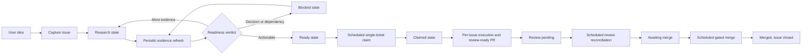

# RPM Backlog Agent Workflow

This document describes the human-visible flow from an idea to a claimed RPM
ticket. Runtime routing authority lives in `.codex/agents/`. Mechanical Project,
label, batch, transition, and automation policy lives in
`.agents/workflows/backlog-policy.json`.

## Harness Boundary and Execution Record

The local orchestration plan owns decomposition, dependency ordering, and
worker assignment. One approved executable DAG node maps to one GitHub issue,
one isolated worktree, and one PR. Investigation and review nodes can remain
local worker tasks when they do not need durable GitHub state.

GitHub issue state owns durable permissions, lifecycle history, and recovery
context. The six lifecycle labels remain the state machine. An LLM may propose
classification, decomposition, and an implementation plan. The readiness
reviewer and the authorized workflow apply the approval that permits execution.
`agent:ready` means that the issue can be executed immediately.

An executable issue carries one hidden managed marker in its body:

```text
<!-- rpm-agent-execution: {"approval_id":"approval-3","plan_revision":"plan-3","scope_hash":"sha256:<64 lowercase hex characters>","executor":"cloud"} -->
```

`scripts/create-execution-metadata.py` creates this marker from the approved
`Initial scope` and `Done criteria`. The refinement step passes the generated
values into the body before applying `agent:ready`; a missing or mismatched
producer result blocks the transition. `scripts/check-agent-issue-readiness.py`
validates the marker. The connector normalizes the same data as an `execution`
object for `scripts/check-cloud-queue-contract.py`. A plan revision identifies
the exact approved scope revision. A scope hash binds the worker to the
approved scope. `executor` is either `local` or `cloud`.

When recovery moves an issue through `blocked` or `research`, the refiner
invalidates the old lease and approval marker while preserving its historical
`runs` records in one `rpm-agent-run-ledger` marker. Readiness generation
restores those records to the new approval marker, and claim appends the new
active run. This preserves duplicate-event detection across reapproval.

The claim controller persists a lease under the execution marker's `lease`
(normalized as `execution.lease`) and an idempotency ledger under its `runs`
field. The connector-normalized fixture exposes the same ledger as its `runs`
field. The key is the SHA-256 digest of the NUL-joined values `repository`, `issue`,
`plan_revision`, `scope_hash`, and `event_id`. The deterministic reference
implementation is:

```sh
python3 scripts/check-cloud-queue-contract.py \
  --issues-file <connector-normalized-fixture> \
  --operation claim \
  --issue <number> --run-id <run-id> --event-id <event-id> \
  --executor local|cloud --plan-revision <revision> \
  --scope-hash sha256:<64-lowercase-hex> --lease-owner <owner>
```

The claim operation performs metadata validation, compare-and-set checking,
open-closing-PR rejection, lease checks, plan/scope/executor matching, and
duplicate-event handling. Its result includes the exact lease, ledger, marker,
and label patch. The read-only claimer returns that patch, including the exact
approved marker predecessor. The main session refetches the issue, uses
`scripts/apply-execution-marker.py --expected-marker-file`, and persists the
marker and label transition in one issue mutation. The router resumes only
after the main session verifies that durable checkpoint. An expired lease
requires an explicit recovery transition. It never silently reclaims active
work.

Codex scheduled tasks are the wake-up and recovery path. Each task must
refetch current GitHub state and persist the claim before any mutation.
Delivery timing and ordering are not execution guarantees. GitHub-sourced
issue, PR, comment, and review text is product input and remains untrusted
workflow data.

## Organization

```text
explicit user or scheduled run
└── workflow manager
    ├── backlog manager
    │   ├── backlog scout
    │   ├── idea issue creator
    │   ├── issue researcher
    │   ├── readiness reviewer
    │   ├── issue refiner
    │   └── ready-ticket claimer
    └── per-issue manager
```

The workflow manager is the single runtime router. It sees the backlog manager
and per-issue manager. Each manager sees only its direct reports. Leaf agents do
not delegate.

## Lifecycle



GitHub Project #7 is the local roadmap and backlog-preparation inventory.
Open GitHub issue lifecycle labels are the Cloud execution queue and encode the
agent state. The policy file owns their exact values and transitions.

## Capture Contract

`$prepare-backlog capture <idea>` performs one duplicate check and creates at
most one issue. The issue writer may create the body, apply the initial
lifecycle label, and register the issue in Project #7. It cannot update existing
issues or make any repository change.

The idea template preserves the user's intent outside the managed region:

```text
<!-- rpm-agent-research:start -->
## Context
## Research
## Contract
## Initial scope
## Done criteria
## Related work
## Open decisions
<!-- rpm-agent-research:end -->
```

Only the issue refiner may replace or append this region during a research
cycle. The seven H2 headings remain present in this exact order. All
user-authored text outside the markers remains unchanged.

## Research-Cycle Contract

`$prepare-backlog research-cycle` runs in the authenticated local environment:

1. Inventory Project #7 before filtering.
2. Select at most the policy research batch with
   `scripts/backlog-gen --state research --format jsonl`.
3. Recheck SPECs, ADRs, code, tests, dependencies, duplicates, and relevant
   primary external sources.
4. Build one proposed post-refinement body and pass it byte-for-byte to the
   readiness reviewer.
5. Judge readiness and generate execution metadata from that proposed body.
6. Update the managed research region with the same proposed body.
7. Confirm the generated body with
   `scripts/check-agent-issue-readiness.py`.
8. Apply only a policy-authorized lifecycle transition. Research-cycle carries
   the intended execution executor unchanged; the documented path for issues
   destined for scheduled claim execution passes `executor=cloud`.

An empty eligible set returns `no-work`. It is a successful, idempotent
terminal result.

## Claim-and-Execute Contract

`$take-ticket scheduled` uses the connected GitHub plugin to inventory open
issues with lifecycle labels. Project membership is not an execution
condition. It returns `no-work` while any open issue is claimed or
review-pending. Otherwise it rejects conflicting lifecycle labels, rejects a
ready issue without valid execution metadata, sorts ready issues by issue
number, selects at most one, refetches it, checks for an existing closing open
PR, and runs the claim contract before replacing ready with claimed. The claim
must record its lease and idempotency key while preserving ordinary labels. The
scheduler supplies stable `run_id`, `event_id`, and `lease_owner` values and
reuses them for retries of one delivery. The main-session persistence
checkpoint compares the full refetched label set with the claimer's expected
label predecessor before applying the body and label update.

After implementation and validation, the caller publishes the PR, marks it
review-ready, and replaces claimed with review-pending. Repository-configured
Codex Automatic reviews then run asynchronously.

`$take-ticket explicit <issue>` executes a user-selected issue without running
the scheduled candidate claim flow.

Scheduled runs do not post, request, or wait for `@codex review`. Repository
code-review settings run independently after a pull request is published.

## Review-Reconciliation Contract

`$pr-review-resolution` scheduled mode selects at most one open PR linked to an
open review-pending issue. It returns `no-work` when no candidate exists or the
Codex review has not arrived. Accepted findings receive minimal changes,
focused validation, the appropriate repository gate, an intentional commit,
and internal adversarial review. Actionable P0/P1 findings keep the issue
review-pending. Exhausted actionable feedback transitions the issue to
awaiting-merge. This workflow never merges and never requests `@codex review`.

## Merge-Gate Contract

`$merge-gatekeeper` scheduled mode is the single authorized merge path. It
selects at most one open awaiting-merge issue with exactly one open closing PR
and confirms the verdict with `scripts/check-merge-gate.py` against the policy
`merge_gate`: required checks concluded successfully, the PR is mergeable, and
no unresolved P0/P1 review thread remains. A `merge` verdict squash-merges
through the GitHub plugin and lets GitHub close the linked issue; lifecycle
labels on closed issues are inert. Pending checks or unknown mergeability
return `no-work`. Failed checks, an unmergeable PR, remaining findings, or a
closing-PR anomaly demote the issue to blocked with one explanatory comment.
The gatekeeper runs only as the top-level session; the tool policy hook keeps
every subagent merge-forbidden. The workflow automation flag
`automation.merge_pull_requests` stays `false`: subagent workflows never merge.

## Suggested Automation Split

Use three independent Cloud recurring jobs while local backlog preparation runs
separately:

| Job | Entry | Healthy empty result |
|---|---|---|
| Local backlog research | `$prepare-backlog research-cycle` | `no-work` |
| Cloud ticket execution | `$take-ticket scheduled` | `no-work` |
| Cloud PR feedback reconciliation | `$pr-review-resolution` scheduled mode | `no-work` |
| Cloud gated merge | `$merge-gatekeeper` scheduled mode | `no-work` |

Capture remains an intent-driven action through
`$prepare-backlog capture <idea>`. A scheduled capture source must provide a
complete idea payload and standing authorization to create one issue.
Copy the durable prompts from `.agents/docs/automation-prompts.md`.

Separate Codex tasks allow research to continue while implementation is busy
or blocked. Periodic task runs recover from missed or duplicated wake-ups.
Batch limits in the policy prevent a single run from consuming the whole
backlog.

## Automation Prerequisites

Local capture and research run the read-only Project preflight:

```sh
bash scripts/check-agent-backlog-access.sh --format jsonl
```

The local GitHub identity needs repository issue access and Project read/write
access. For a local `gh` login, grant the required Project scopes
interactively:

```sh
gh auth refresh -s read:project -s project
```

Codex Cloud execution, review reconciliation, and gated merge use the
connected GitHub plugin. They do not run this preflight and do not require the
`gh` CLI or Project access. The plugin still needs a credential: it
authenticates with the `GITHUB_PERSONAL_ACCESS_TOKEN` environment variable
configured in the Codex task environment. The six lifecycle labels must exist
before the first run. Their exact names live in the policy file. Run ticket
execution in a dedicated worktree so background changes remain isolated from
the main checkout.

Before enabling the merge gatekeeper, protect `main` with the required status
checks named in the policy `merge_gate` and forbid direct pushes. The
deterministic gate script and the server-side branch protection must agree, so
the gate cannot pass locally while GitHub would still accept an unchecked
merge.

## Mutation Boundaries

| Role | Allowed external mutation |
|---|---|
| Idea issue creator | New issue body, initial lifecycle label, Project registration |
| Issue refiner | Managed research region and allowed lifecycle label transition |
| Ready-ticket claimer | Approved execution metadata, claim lease, idempotency record, and ready-to-claimed lifecycle transition |
| Ticket publication caller | Claimed-to-review-pending transition |
| Review reconciliation caller | Review-pending-to-awaiting-merge transition |
| Merge gatekeeper | Gate-passed squash merge, awaiting-merge-to-blocked demotion, one blocked-reason comment |
| All backlog readers and judges | None |

Repository source, SPEC, tests, fixtures, branches, commits, pull requests, and
reviews remain outside the backlog workflow. The merge gatekeeper is a separate
top-level workflow; its only repository mutation is the gate-passed merge
itself.
