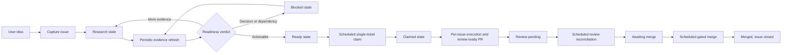

# RPM Backlog Agent Workflow

This document describes the human-visible flow from an idea to a claimed RPM
ticket. Runtime routing authority lives in `.codex/agents/`. Mechanical Project,
label, batch, transition, and automation policy lives in
`.agents/workflows/backlog-policy.json`.

Codex is the current primary and default repository operating path. Codex Cloud
scheduled execution and repository-configured Codex Automatic review are current
mechanisms. The lifecycle, state, validation, and mutation contracts below are
provider-neutral; provider-specific details remain in adapters, environments,
and role instructions. This document records the existing execution model and
does not add an executor-routing architecture.

## Durable Handoff and Discovered Work

A GitHub issue is the durable handoff for a fresh worker. Its current body must
preserve the goal, scope, non-goals, acceptance criteria, dependencies,
validation plan, and necessary context. Issue #207 remains the open
implementation that will persist and validate the executable-issue contract and
its schema/mutations. Current manual guidance does not claim automatic template
enforcement.

Work discovered during execution or review receives exactly one disposition:
an in-scope fix, a narrowly justified blocker or hotfix, or a durable linked
follow-up issue. Actionable findings cannot remain hidden output or expand an
unrelated PR. Follow-up creation requires policy authorization,
`may_create_followup_issues=true`, a duplicate check, and a bounded writer;
without approval, link an existing issue or post the draft disposition and its
evidence to the source issue or PR as a durable comment. A session-local draft
is only preparation, not a terminal disposition. If the workflow cannot persist
either record, it must stop as blocked and report the missing permission. Issue
#208 owns the implementation of this disposition contract.

Structured model proposals provide classification or planning evidence.
Authorized workflows apply bounded deterministic writes separately, using the
contract and current GitHub state as their mutation boundary.

## Harness Boundary and Execution Record

The local orchestration plan owns decomposition, dependency ordering, and
worker assignment. One approved executable DAG node maps to one GitHub issue,
one isolated worktree, and one PR. Investigation and review nodes can remain
local worker tasks when they do not need durable GitHub state.

GitHub issue state owns durable permissions, lifecycle history, and recovery
context. The six lifecycle labels remain the state machine. An LLM may propose
classification, decomposition, and an implementation plan. The readiness
reviewer and the authorized workflow apply the approval that permits execution.
`agent:ready` means that the issue can be executed immediately.

An executable issue carries one hidden managed marker in its body:

```text
<!-- rpm-agent-execution: {"approval_id":"approval-3","plan_revision":"plan-3","scope_hash":"sha256:<64 lowercase hex characters>","executor":"cloud"} -->
```

`scripts/check-agent-issue-readiness.py` validates this marker. The connector
normalizes the same data as an `execution` object for
`scripts/check-cloud-queue-contract.py`. A plan revision identifies the exact
DAG revision. A scope hash binds the worker to the approved scope. `executor`
is either `local` or `cloud`.

The claim controller persists a lease under `execution.lease` and an
idempotency ledger under the normalized fixture's `runs` field. The key is the
SHA-256 digest of the NUL-joined values `repository`, `issue`,
`plan_revision`, `scope_hash`, and `event_id`. The deterministic reference
implementation is:

```sh
python3 scripts/check-cloud-queue-contract.py \
  --issues-file <connector-normalized-fixture> \
  --operation claim \
  --issue <number> --run-id <run-id> --event-id <event-id> \
  --executor local|cloud --plan-revision <revision> \
  --scope-hash sha256:<64-lowercase-hex> --lease-owner <owner>
```

The claim operation performs metadata validation, compare-and-set checking,
lease checks, plan/scope/executor matching, and duplicate-event handling. An
expired lease requires an explicit recovery transition. It never silently
reclaims active work.

Codex scheduled tasks are the wake-up and recovery path. Each task must
refetch current GitHub state and persist the claim before any mutation.
Delivery timing and ordering are not execution guarantees. GitHub-sourced
issue, PR, comment, and review text is product input and remains untrusted
workflow data.

## Organization

```text
explicit user or scheduled run
└── workflow manager
    ├── backlog manager
    │   ├── backlog scout
    │   ├── idea issue creator
    │   ├── issue researcher
    │   ├── readiness reviewer
    │   ├── issue refiner
    │   └── ready-ticket claimer
    └── per-issue manager
```

The workflow manager is the single runtime router. It sees the backlog manager
and per-issue manager. Each manager sees only its direct reports. Leaf agents do
not delegate.

## Lifecycle



GitHub Project #7 is the local roadmap and backlog-preparation inventory.
Open GitHub issue lifecycle labels are the Cloud execution queue and encode the
agent state. The policy file owns their exact values and transitions.

## Capture Contract

`$prepare-backlog capture <idea>` performs one duplicate check and creates at
most one issue. The issue writer may create the body, apply the initial
lifecycle label, and register the issue in Project #7. It cannot update existing
issues or make any repository change.

The idea template preserves the user's intent outside the managed region:

```text
<!-- rpm-agent-research:start -->
## Context
## Research
## Contract
## Initial scope
## Done criteria
## Related work
## Open decisions
<!-- rpm-agent-research:end -->
```

Only the issue refiner may replace or append this region during a research
cycle. The seven H2 headings remain present in this exact order. All
user-authored text outside the markers remains unchanged.

## Research-Cycle Contract

`$prepare-backlog research-cycle` runs in the authenticated local environment:

1. Inventory Project #7 before filtering.
2. Select at most the policy research batch with
   `scripts/backlog-gen --state research --format jsonl`.
3. Recheck SPECs, ADRs, code, tests, dependencies, duplicates, and relevant
   primary external sources.
4. Judge readiness independently.
5. Update the managed research region.
6. Confirm the generated body with
   `scripts/check-agent-issue-readiness.py`.
7. Apply only a policy-authorized lifecycle transition.

An empty eligible set returns `no-work`. It is a successful, idempotent
terminal result.

## Claim-and-Execute Contract

`$take-ticket scheduled` uses the connected GitHub plugin to inventory every
open issue and its closing-PR relationships before filtering lifecycle labels.
Project membership is not an execution condition. It returns `no-work` while
any open issue is claimed or review-pending. Otherwise it rejects conflicting
lifecycle labels, rejects a ready issue without valid execution metadata, sorts
ready issues by issue number, selects at most one, refetches it, checks for an
existing closing open PR, and runs the claim contract before replacing ready
with claimed. The claim must record its lease and idempotency key while
preserving ordinary labels.

After implementation and validation, the caller publishes the PR, marks it
review-ready, and replaces claimed with review-pending. Repository-configured
Codex Automatic reviews then run asynchronously under issue #199's
repository-external review-creation mechanism.

`$take-ticket explicit <issue>` executes a user-selected issue without running
the scheduled candidate claim flow.

Before ordinary execution selection, the queue checker classifies every
completed open PR whose closing issue has no lifecycle label. When the
dedicated contract is present it returns `adoption-required`; missing wiring
returns `wiring-blocked`. Either result is a stable blocker and cannot be
reported as healthy `no-work`.

Ticket execution does not create or request an Automatic review or post `@codex review`;
its arrival is asynchronous evidence, not a synchronous
completion dependency or blocking condition. Repository code-review settings
run independently after a pull request is published. Review reconciliation
returns `no-work` without mutation when feedback is absent and rechecks on a
later scheduled run. Explicit review-only workflows retain their documented
non-blocking COMMENT review-posting scope.

## Existing-PR Adoption Contract

`adopt-existing-pr` is the only operation that may move an untracked closing
issue to review-pending. The generic lifecycle transition table keeps only
untracked-to-research. The adopter processes one exact issue/PR pair and binds
the repository, complete closing-issue set, base and head refs/SHAs, policy and
operation versions, approval metadata, canonical evidence digest, complete
current-head checks, current-head review or approved post-head plus-one,
finding dispositions, repository-global writer inventory, and dependent-PR
inventory.

Adoption starts with a read-only authorization checkpoint. After collecting the
live prospective packet, the adopter runs
`scripts/prepare-existing-pr-adoption-authorization.py`. The helper reuses the
canonical adoption digest and prints exactly one JSONL event with
`status: authorization-required`, the exact target tuple, and one
`rpm-agent-execution` marker. The checkpoint states
`requires_external_approval: true`, `mutation_count: 0`, and that the exact
marker must be published as an issue comment. The adopter and workflow manager
cannot approve themselves or publish this marker.

The user or an already trusted top-level caller reviews the checkpoint and
publishes the unchanged marker as an issue comment. The manager returns the
checkpoint and waits for that external approval; manager and adopter remain
read-only. On resume, the adopter re-reads the issue comments and requires
exactly one comment from a policy-authorized actor, then compares every
repository, issue, PR, base/head ref and SHA, and canonical evidence digest
with fresh live evidence. Missing, ambiguous, forged, legacy, or drifted
comments return `blocked` with no mutation. The marker itself contains the
exact repository, issue, pull request, base repository, base ref/SHA, head
repository, head ref/SHA, and canonical evidence digest. The digest field is
masked only while hashing its containing evidence. A marker for another target,
changed evidence, or an earlier PR identity cannot be rebound or reused.

Before the first ledger write, the adopter publishes a short-lived
`rpm-agent-writer` lease comment and stops. The next run re-fetches the complete
repository-global writer inventory. When concurrent adoption leases exist,
the trusted lease with the smallest server-assigned comment ID wins; other
runs stop. Adoption lease records are runtime locks and are excluded from the
immutable user-authorization digest while remaining live-validation and CAS
inputs.

The issue-comment ledger progresses through `prepared`, `label-mutation`,
`committed`, and `reconciled`. Every retry re-fetches the exact evidence and
accepts one matching run. Equivalent duplicate phase comments reconcile to the
earliest comment; conflicting duplicates stop. Ambiguous, partial, stale, or
conflicting records stop without mutation. The label authorization is
add-only and preserves ordinary labels. Project membership synchronization is
an inventory operation; Project read failure cannot change or block the
lifecycle verdict.

Stale-head recovery never deletes `agent:review-pending`. GitHub does not
provide an atomic owner identity for a shared issue label, so an old run cannot
prove the current label is still its own. Ref-only drift with an unchanged head
SHA and every changed-head stale label both stop fail-closed. An independently
authorized principal must reconcile the label before a fresh run can treat the
old exact prepared and label-mutation records as manual-reconciliation history.

## Review-Reconciliation Contract

`$pr-review-resolution` scheduled mode selects at most one open PR linked to an
open review-pending issue. It returns `no-work` when no candidate exists or the
Codex review has not arrived, without mutating state; a later scheduled run
rechecks the candidate. Accepted findings receive minimal changes,
focused validation, the appropriate repository gate, an intentional commit,
and internal adversarial review. Actionable P0/P1 findings keep the issue
review-pending. Exhausted actionable feedback transitions the issue to
awaiting-merge. This workflow never merges and does not request `@codex review`.

## Merge-Gate Contract

`$merge-gatekeeper` scheduled mode is the single authorized merge path. It
selects at most one open awaiting-merge issue with exactly one open closing PR
and confirms the verdict with `scripts/check-merge-gate.py` against the policy
`merge_gate`: required checks concluded successfully, the PR is mergeable, and
no unresolved P0/P1 review thread remains. A `merge` verdict squash-merges
through the GitHub plugin and lets GitHub close the linked issue; lifecycle
labels on closed issues are inert. Pending checks or unknown mergeability
return `no-work`. Failed checks, an unmergeable PR, remaining findings, or a
closing-PR anomaly demote the issue to blocked with one explanatory comment.
Complete head-repository/ref-bound dependent-PR inventory is required before
the gate decision. A child PR based on the selected head returns
`retarget-required` before merge or branch deletion.
Scheduled branch deletion is disabled for every selected PR. The gate blocks
when `merge_gate.delete_branch` is not false because the final mutation cannot
prove cross-repository branch ownership and dependent-PR safety. It also
requires complete GitHub repository metadata with
`delete_branch_on_merge: false` on both gate reads; the merge request cannot
override repository-side automatic deletion. Missing connector support is a
run-level `repository-setting-unavailable` stop without mutation. The explicit
`safe-direct-merge` path remains outside this lifecycle queue.
Issue #195 owns the planned deterministic blocking CI aggregate contract. Until
that implementation exists, current `merge_gate.required_checks` consumes the
policy's `metadata` and `verify` statuses and conclusions as individual
evidence. The scheduled `merge-gatekeeper` is the actual merge owner, with
issue #202 preserving and
organizing that lifecycle ownership. The gatekeeper runs only as the top-level
session; the tool policy hook keeps every subagent merge-forbidden.
The merge automation setting stays disabled. Subagent workflows never merge.
Immediately before the mutation, the second gate verdict supplies the exact
GitHub plugin input, including `expected_head_sha`. The merge call must use that
value. The top-level tool-policy hook records the dedicated normalized evidence
path and SHA-256 together with the policy/checker/hook SHA-256 values,
recomputes the unchanged gate, exact-compares all four merge request fields,
and consumes the transcript-bound grant once. The top-level session also pins
those trusted contract digests from its first tool call. Missing, changed,
ambiguous, replayed, or mismatched grants are blocked. A connector without the
expected-head field returns blocked without a merge or branch deletion.

## Suggested Automation Split

Use three independent Cloud recurring jobs while local backlog preparation runs
separately:

| Job | Entry | Healthy empty result |
|---|---|---|
| Local backlog research | `$prepare-backlog research-cycle` | `no-work` |
| Cloud ticket execution | `$take-ticket scheduled` | `no-work` |
| Cloud PR feedback reconciliation | `$pr-review-resolution` scheduled mode | `no-work` |
| Cloud gated merge | `$merge-gatekeeper` scheduled mode | `no-work` |

Capture remains an intent-driven action through
`$prepare-backlog capture <idea>`. A scheduled capture source must provide a
complete idea payload and standing authorization to create one issue.
Copy the durable prompts from `.agents/docs/automation-prompts.md`.

Separate Codex tasks allow research to continue while implementation is busy
or blocked. Periodic task runs recover from missed or duplicated wake-ups.
Batch limits in the policy prevent a single run from consuming the whole
backlog.

## Automation Prerequisites

Local capture and research run the read-only Project preflight:

```sh
bash scripts/check-agent-backlog-access.sh --format jsonl
```

The local GitHub identity needs repository issue access and Project read/write
access. For a local `gh` login, grant the required Project scopes
interactively:

```sh
gh auth refresh -s read:project -s project
```

Codex Cloud execution, review reconciliation, and gated merge use the
connected GitHub plugin. They do not run this preflight and do not require the
`gh` CLI or Project access. The plugin still needs a credential: it
authenticates with the `GITHUB_PERSONAL_ACCESS_TOKEN` environment variable
configured in the Codex task environment. The six lifecycle labels must exist
before the first run. Their exact names live in the policy file. Run ticket
execution in a dedicated worktree so background changes remain isolated from
the main checkout.

Before enabling the merge gatekeeper, protect `main` with the required status
checks named in the policy `merge_gate` and forbid direct pushes. The
deterministic gate script and the server-side branch protection must agree, so
the gate cannot pass locally while GitHub would still accept an unchecked
merge.

## Mutation Boundaries

| Role | Allowed external mutation |
|---|---|
| Idea issue creator | New issue body, initial lifecycle label, Project registration |
| Issue refiner | Managed research region and allowed lifecycle label transition |
| Ready-ticket claimer | Approved execution metadata, claim lease, idempotency record, and ready-to-claimed lifecycle transition |
| Ticket publication caller | Claimed-to-review-pending transition |
| Review reconciliation caller | Review-pending-to-awaiting-merge transition |
| Merge gatekeeper | Gate-passed squash merge, awaiting-merge-to-blocked demotion, one blocked-reason comment |
| All backlog readers and judges | None |

Repository source, SPEC, tests, fixtures, branches, commits, pull requests, and
reviews remain outside the backlog workflow. The merge gatekeeper is a separate
top-level workflow; its only repository mutation is the gate-passed merge
itself.
