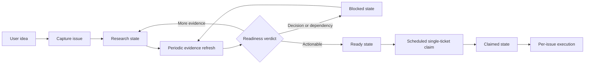

# RPM Backlog Agent Workflow

This document describes the human-visible flow from an idea to a claimed RPM
ticket. Runtime routing authority lives in `.codex/agents/`. Mechanical Project,
label, batch, transition, and automation policy lives in
`.agents/workflows/backlog-policy.json`.

## Organization

```text
explicit user or scheduled run
└── workflow manager
    ├── backlog manager
    │   ├── backlog scout
    │   ├── idea issue creator
    │   ├── issue researcher
    │   ├── readiness reviewer
    │   ├── issue refiner
    │   └── ready-ticket claimer
    └── per-issue manager
```

The workflow manager is the single runtime router. It sees the backlog manager
and per-issue manager. Each manager sees only its direct reports. Leaf agents do
not delegate.

## Lifecycle



GitHub Project #7 is the public backlog inventory. Lifecycle labels encode the
agent state. The policy file owns their exact values and transitions.

## Capture Contract

`$prepare-backlog capture <idea>` performs one duplicate check and creates at
most one issue. The issue writer may create the body, apply the initial
lifecycle label, and register the issue in Project #7. It cannot update existing
issues or make any repository change.

The idea template preserves the user's intent outside the managed region:

```text
<!-- rpm-agent-research:start -->
## Context
## Research
## Contract
## Initial scope
## Done criteria
## Related work
## Open decisions
<!-- rpm-agent-research:end -->
```

Only the issue refiner may replace or append this region during a research
cycle. The seven H2 headings remain present in this exact order. All
user-authored text outside the markers remains unchanged.

## Research-Cycle Contract

`$prepare-backlog research-cycle` runs manually or on a schedule:

1. Inventory Project #7 before filtering.
2. Select at most the policy research batch with
   `scripts/backlog-gen --state research --format jsonl`.
3. Recheck SPECs, ADRs, code, tests, dependencies, duplicates, and relevant
   primary external sources.
4. Judge readiness independently.
5. Update the managed research region.
6. Confirm the generated body with
   `scripts/check-agent-issue-readiness.py`.
7. Apply only a policy-authorized lifecycle transition.

An empty eligible set returns `no-work`. It is a successful, idempotent
terminal result.

## Claim-and-Execute Contract

`$take-ticket scheduled` inventories ready candidates, claims at most the policy
execution batch through `scripts/backlog-gen --state ready --format jsonl`, and
starts the per-issue workflow for the claimed issue. The
claimer changes only the ready lifecycle label to the claimed lifecycle label.
It does not assign a user, edit the issue body, or change Project fields.

`$take-ticket explicit <issue>` executes a user-selected issue without running
the scheduled candidate claim flow.

Scheduled runs do not post, request, or wait for `@codex review`. Repository
code-review settings run independently after a pull request is published.

## Suggested Automation Split

Use two independent recurring jobs:

| Job | Entry | Healthy empty result |
|---|---|---|
| Backlog research | `$prepare-backlog research-cycle` | `no-work` |
| Ticket execution | `$take-ticket scheduled` | `no-work` |

Capture remains an intent-driven action through
`$prepare-backlog capture <idea>`. A scheduled capture source must provide a
complete idea payload and standing authorization to create one issue.
Copy the durable prompts from `.agents/docs/automation-prompts.md`.

Separate jobs allow research to continue while implementation is busy or
blocked. Batch limits in the policy prevent a single run from consuming the
whole backlog.

## Automation Prerequisites

Both jobs run the read-only preflight:

```sh
bash scripts/check-agent-backlog-access.sh --format jsonl
```

The GitHub identity used by the scheduled task needs repository issue access
and Project read/write access. For a local `gh` login, grant the required
Project scopes interactively:

```sh
gh auth refresh -s read:project -s project
```

The queue labels must exist before the first run. Their exact names live in the
policy file. Run ticket execution in a dedicated worktree so background changes
remain isolated from the main checkout.

## Mutation Boundaries

| Role | Allowed external mutation |
|---|---|
| Idea issue creator | New issue body, initial lifecycle label, Project registration |
| Issue refiner | Managed research region and allowed lifecycle label transition |
| Ready-ticket claimer | Ready-to-claimed lifecycle transition |
| All backlog readers and judges | None |

Repository source, SPEC, tests, fixtures, branches, commits, pull requests, and
reviews remain outside the backlog workflow.
