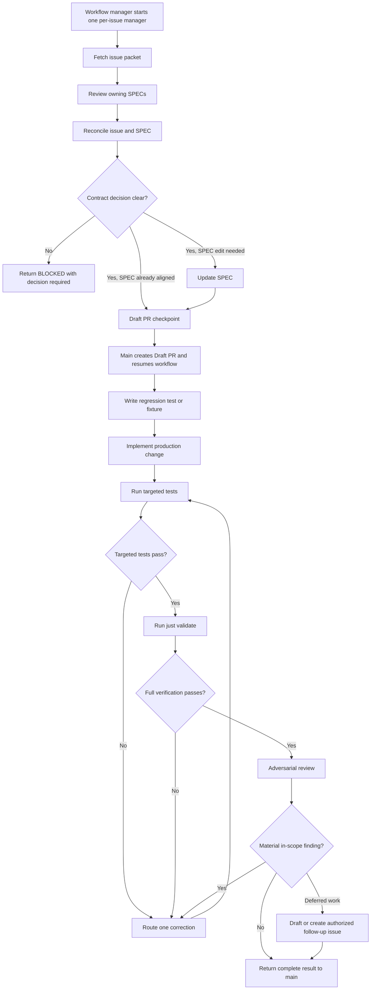

# RPM Per-Issue Agent Workflow

This document describes the human-visible organization for one GitHub issue.
Runtime routing authority lives in the workflow and per-issue manager
configuration under `.codex/agents/`. Backlog and lifecycle mechanics live in
`.agents/workflows/backlog-policy.json`.

## Organization

```text
explicit user or scheduled run
└── workflow manager
    └── per-issue manager
        ├── issue fetcher
        ├── SPEC reviewer
        ├── issue/SPEC reconciler
        ├── SPEC updater
        ├── test author
        ├── production implementer
        ├── targeted test runner
        ├── full verifier
        ├── adversarial reviewer
        └── follow-up issue creator
```

The main session owns user decisions, final scope acceptance, Draft PR creation,
commits, pushes, PR state, and the final report. The workflow manager is the
single entry router. One per-issue manager owns the process for one issue. Leaf
agents receive only their inputs, scope, and output contract.

## Role Taxonomy and Adjacent Boundaries

The repository validator owns the machine-readable taxonomy for all 20 custom
agent TOMLs. Each role has one category, one distinct responsibility, and one
coordination boundary. The validator checks this static inventory; the
coordinator enforces runtime sequencing and writer handoffs.

| Role | Category | Coordination | Distinct responsibility |
|---|---|---|---|
| `rpm_workflow_manager` | backlog | coordinator | routes one requested workflow mode to one manager |
| `rpm_backlog_manager` | backlog | coordinator | coordinates one bounded backlog mode and its handoffs |
| `rpm_issue_manager` | reconciliation | coordinator | coordinates one issue state machine and writer handoffs |
| `rpm_backlog_scout` | discovery/research | independent-read | inventories one candidate source and duplicate evidence |
| `rpm_issue_fetcher` | discovery/research | independent-read | fetches one canonical issue packet and linked context |
| `rpm_issue_researcher` | discovery/research | independent-read | builds one evidence-backed implementation research packet |
| `rpm_spec_reviewer` | review | independent-read | classifies the owning SPEC impact for one issue |
| `rpm_issue_readiness_reviewer` | review | sequential-read | judges whether one researched issue is actionable |
| `rpm_adversarial_reviewer` | review | sequential-read | tries to falsify one validated change against its evidence |
| `rpm_issue_spec_reconciler` | reconciliation | sequential-read | compares one issue intent with its active SPEC decision |
| `pr-review-resolver` | reconciliation | single-writer | classifies review feedback and applies accepted fixes |
| `rpm_spec_updater` | implementation | single-writer | writes one already-approved contract update |
| `rpm_implementer` | implementation | single-writer | writes one approved production behavior change |
| `rpm_test_author` | testing | single-writer | writes focused regression tests and deterministic fixtures |
| `rpm_test_runner` | testing | sequential-read | runs supplied targeted tests and reports exact evidence |
| `rpm_verifier` | testing | sequential-read | runs the full repository validation gate |
| `rpm_idea_issue_creator` | mutation | single-writer | creates one authorized idea issue and registration |
| `rpm_issue_refiner` | mutation | single-writer | updates one managed research section and lifecycle state |
| `rpm_ready_ticket_claimer` | mutation | single-writer | claims one ready issue through the allowed state transition |
| `rpm_followup_issue_creator` | mutation | single-writer | creates one explicitly authorized deferred follow-up issue |

### Retained-distinct adjacent roles

| Pair | Disposition |
|---|---|
| scout ↔ researcher | scout inventories candidates; researcher investigates one selected issue |
| SPEC reviewer ↔ SPEC reconciler | SPEC reviewer classifies the owning contract; SPEC reconciler compares issue intent with that classification |
| targeted runner ↔ verifier | targeted runner executes supplied commands; verifier runs the full repository gate |
| workflow manager ↔ issue manager | workflow manager routes a top-level mode; issue manager owns one issue state machine |
| adversarial reviewer ↔ PR resolver | adversarial reviewer finds correctness gaps; PR resolver classifies actionable feedback and applies accepted fixes |
| SPEC updater ↔ implementer | SPEC updater writes approved contract text; implementer writes production behavior |

## DAG and Worktree Harness

The main session owns the global DAG and final integration. It assigns each
executable node to one worker task with an isolated worktree and a disjoint
write scope. The worker receives the current `plan_revision`, `scope_hash`,
executor, acceptance criteria, and validation contract. Worker output returns
to the main session as evidence and a structured result.

The main session may keep decomposition, dependency analysis, and review as
local worker tasks. A node becomes a GitHub issue when it needs durable state,
permission, recovery, or a PR. This keeps GitHub lifecycle labels aligned with
executable work while allowing internal DAG nodes to remain lightweight.

When decomposition or scope changes, the main session creates a new
`plan_revision` and recomputes `scope_hash`. Existing workers finish only if
their revision still matches. A stale worker returns `blocked` and performs no
mutation. The claim controller binds the issue, revision, scope, executor,
lease, and event id through the policy-defined idempotency key.

## Process



## Concurrency Rules

- Read-only exploration and independent review may run in parallel.
- SPEC writing, test writing, production implementation, and review-fix writing
  run sequentially.
- Each task has at most one active write owner. Writer handoffs are sequential,
  and the next writer starts only after the previous writer returns its result.
- Two agents must not edit overlapping files concurrently.
- Concurrent issues require separate worktrees.
- One issue, one active claim lease, and one worker worktree are the default
  execution unit.
- The default correction-loop budget is two.

## Authority Boundaries

| Role | Repository writes | Command execution | External mutation |
|---|---:|---:|---:|
| Main session | Final integration | As needed | Commits, pushes, PR state |
| Workflow manager | No | No validation | No |
| Per-issue manager | No | No validation | No |
| Issue/SPEC reviewers | No | Read-only discovery | No |
| SPEC updater | `docs/specs/**` only | Narrow checks | No |
| Test author | Tests and fixtures only | No full gate | No |
| Implementer | Approved production paths | No full gate | No |
| Test runner | Read-only workspace | Supplied targeted tests | No |
| Verifier | Read-only workspace | `just validate` | No |
| Adversarial reviewer | No | Read-only inspection | No |
| Follow-up issue creator | Read-only workspace and temporary body | Duplicate check and issue helper | Explicit authorization required |

Codex custom agents use `sandbox_mode = "read-only"` for judgment roles.
Command-only roles redirect Cargo build artifacts to
`/tmp/rpm-codex-target`, keeping the repository read-only. Their outputs include
exact commands and exit codes.

The project tool-policy hooks record each RPM subagent type at start. Leaf
agents are blocked from spawning agents. Read-only roles are blocked from
repository patch tools. Writer patches are constrained by role:

- SPEC updater: `docs/specs/**`
- test author: `tests/**` and explicitly scoped test modules under `src/**`
- implementer: production paths, excluding tests, SPECs, and agent configuration
- PR review resolver: accepted review fixes across production, test, and SPEC
  paths, excluding agent configuration

MCP calls are limited by the project tool-policy hook to each role's assigned
read or mutation boundary. Backlog GitHub writers, issue intake, and authorized
follow-up handling have separate allowlists. Unmapped main-session tool calls
remain unaffected.

## Terminal Results

The per-issue manager returns one JSONL `issue_workflow_result` with one of
these states. The workflow manager relays it to the caller:

- `checkpoint`: the main session must create the Draft PR and resume the same workflow run.
- `complete`: contract, tests, implementation, validation, and review converged.
- `blocked`: an explicit decision, permission, tool, or unresolved finding prevents safe progress.

Follow-up issue creation defaults to disabled. A valid finding produces a draft
until `may_create_followup_issues=true` is supplied.

## Review Boundary

The adversarial reviewer is an internal correctness gate over the issue, SPEC,
diff, tests, and validation evidence. The ticket workflow marks the validated
PR review-ready and moves the linked issue to review-pending. It does not post,
request, or wait for `@codex review`. Repository-configured Codex Automatic
review runs independently. The scheduled reconciliation workflow applies
accepted findings and moves an exhausted review to awaiting-merge.

## Completion Enforcement

The project `SubagentStop` hook matches the per-issue manager. When the manager
returns `status:"complete"`, the hook runs `just validate` with Cargo artifacts
under `/tmp/rpm-codex-target`. Exit code `2` blocks completion when the gate is
red. Checkpoint and blocked results remain returnable so the main session can
make the required decision.

Project hooks require one-time trust review in Codex after their contents
change.
